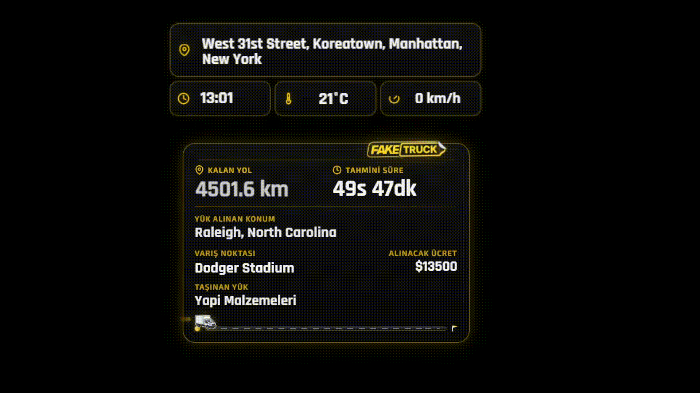

<h1 align="center">🚚 FakeTruck Overlay</h1>

<p align="center">
  OBS browser source olarak çalışan, IRL / trucking tarzı yayınlar için gerçek zamanlı stream overlay sistemi.
</p>

<p align="center">
  
  
  
  
  
</p>

<p align="center">
  
  
  
  
  
</p>

## ✨ Proje Özeti

FakeTruck Overlay, IRL / trucking-style yayınlarda canlı rota hissi veren, OBS içine browser source olarak eklenebilen bir yayın overlay projesidir.

Bu proje, Kick yayıncısı [kick.com/GokhanOner](https://kick.com/GokhanOner) için özel olarak tasarlanmıştır.

Yayıncı; canlı konumu, varış noktasını, pickup noktasını, rota mesafesini, tahmini süreyi, yük bilgisini ve yayın modunu dinamik şekilde ekranda gösterebilir. Sistem Kick chat komutlarıyla da kontrol edilebildiği için moderatörler veya yetkili kullanıcılar yayın sırasında rotayı, görünümü ve overlay durumunu hızlıca güncelleyebilir.

Amaç, klasik harita panelinden daha stream-friendly bir deneyim üretmek: okunaklı, hareketli, kompakt ve yayın üstünde doğal duran bir trucking HUD.

## 🎬 Önizleme

<p align="center">
  
</p>

## 🧩 Öne Çıkanlar

- 🚚 OBS için ayrı overlay ekranları: yol HUD'u, lokasyon paneli ve harita overlay'i.
- 📍 RTIRL pull key ile canlı konum verisi okuma.
- 🛣️ OSRM üzerinden gerçek rota mesafesi ve süre hesaplama.
- 🗺️ Nominatim / OpenStreetMap ile adres arama ve reverse geocoding.
- 💬 Kick chat üzerinden yetkili komutlarla rota, yük, ücret ve görünüm kontrolü.
- 🧑‍💻 Admin panelinden overlay ayarları, hedef konum, pickup, komut kısayolları ve RTIRL ayarı yönetimi.
- 📡 Server-Sent Events ile admin panelde canlı Kick komut akışı ve sistem geri bildirimi.

## 🛠️ Kullanılan Teknolojiler

| Teknoloji | Nerede Kullanılıyor? |
| --- | --- |
| **Node.js 20** | Uygulamanın backend runtime'ı. Express sunucusu, API endpoint'leri, state yönetimi, Kick WebSocket dinleyicisi ve harici servis istekleri burada çalışıyor. |
| **Express 5** | Static overlay dosyalarını servis ediyor; `/api/state`, `/api/location`, `/api/route`, `/api/geocode`, `/api/kick/status` gibi endpoint'leri yönetiyor. |
| **Vanilla HTML / CSS / JavaScript** | `public/` altındaki admin panel ve OBS overlay ekranları framework kullanmadan hazırlanmış. Bu sayede OBS browser source içinde hafif ve hızlı çalışıyor. |
| **WebSocket (`ws`)** | Kick chat mesajlarını Pusher uyumlu WebSocket bağlantısı üzerinden dinlemek ve chat komutlarını gerçek zamanlı işlemek için kullanılıyor. |
| **Server-Sent Events** | Admin panelde canlı event log, Kick komut durumu ve state değişikliklerini anlık göstermek için `/api/events` hattında kullanılıyor. |
| **RTIRL** | Yayıncının canlı lokasyon datasını pull key ile almak ve overlay'e taşımak için kullanılıyor. |
| **OSRM** | Anlık konum ile hedef/pickup noktası arasında sürüş rotası, mesafe ve tahmini süre hesaplamak için kullanılıyor. |
| **Nominatim / OpenStreetMap** | Admin panel ve chat komutlarından girilen adresleri koordinata çevirmek, koordinatları okunabilir lokasyon etiketlerine dönüştürmek için kullanılıyor. |

## 🧠 Sistem Nasıl Çalışıyor?

FakeTruck Overlay'in merkezinde Express tabanlı tek bir Node.js servisi var. Bu servis hem OBS'in açtığı HTML overlay dosyalarını sunuyor hem de overlay'lerin ihtiyaç duyduğu canlı veriyi API olarak sağlıyor.

`server.js`, uygulama state'ini JSON dosyalarında tutar, RTIRL lokasyonunu alır, OSRM ile rota hesaplar ve Nominatim üzerinden lokasyon araması yapar. `lib/state-store.js`, `lib/chat-commands.js`, `lib/kick-ws.js` ve `lib/admin-events.js` dosyaları bu ana akışı daha yönetilebilir parçalara böler.

Admin panelden veya yetkili Kick chat komutlarından gelen değişiklikler state'e yazılır. Overlay ekranları düzenli olarak bu state'i ve canlı lokasyonu okuyarak yayındaki HUD'u günceller. Böylece yayıncı OBS tarafında sadece browser source kullanırken, arka tarafta rota, konum, chat komutu ve görünürlük akışı canlı kalır.

## 🗂️ Proje Yapısı

```text
public/
  admin.html             # Overlay yönetim paneli
  road-overlay.html      # Ana trucking HUD / rota overlay'i
  hud-overlay.html       # RTIRL lokasyon-zaman overlay'i
  map-overlay.html       # Harita / rota hissi veren görsel overlay

lib/
  app-config.js          # Varsayılan state ve chat komut tanımları
  chat-commands.js       # Kick chat komutlarını parse edip uygular
  kick-ws.js             # Kick WebSocket bağlantısı ve mesaj işleme akışı
  state-store.js         # JSON tabanlı kalıcı state yönetimi
  admin-events.js        # SSE event yayını ve event geçmişi
  location-utils.js      # Lokasyon normalize etme ve etiket üretme yardımcıları

server.js                # Express uygulaması, API'ler ve servis bootstrap'i
kick-utils.js            # Kick yetkilendirme, koordinat parse ve chat yardımcıları
docker-compose.yml       # App + Caddy production kompozisyonu
Dockerfile               # Node 20 production imajı
assets/
  faketruck-preview.gif  # README önizleme GIF'i
```

## ⚠️ Disclaimer

FakeTruck Overlay; Kick, OBS, RTIRL, OSRM, Leaflet, OpenStreetMap veya herhangi bir trucking simulator markasıyla bağlantılı, sponsorlu, onaylı ya da resmi olarak ilişkili değildir.

Bu proje portfolyo incelemesi, demo sunumu ve eğitim amaçlı olarak herkese açık şekilde görüntülenebilir.

## 📄 License

Copyright © 2026 Samet Yılmaz.

This project is publicly visible for portfolio review purposes only.

You may not copy, modify, redistribute, deploy, resell, or use this project or its source code without written permission from the author.
